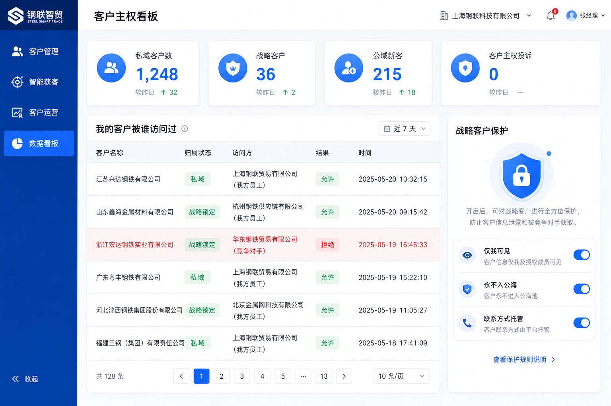
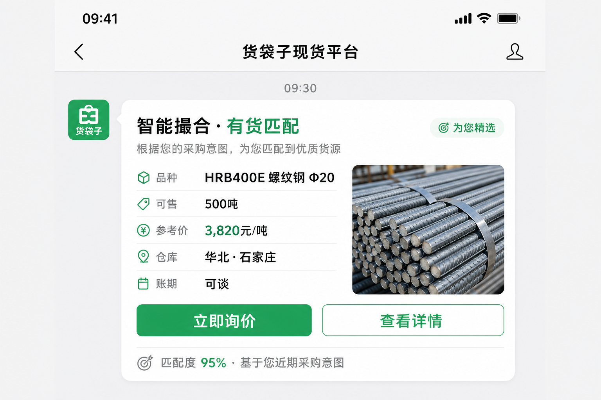
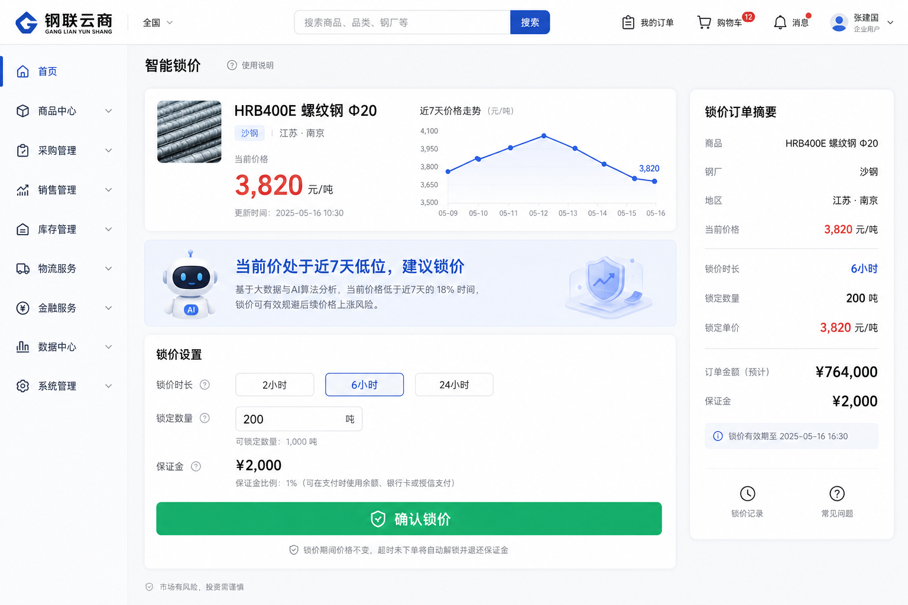

# 08 · 产品原型与关键界面设计

> 把核心场景落成可视化界面原型，配合 `docs/01~07` 的设计与 `prototype/` 的引擎一起理解。原型图位于 `docs/mockups/`。

---

## 1. 客户主权看板（防撬客的"信任界面"）

**设计目标**：让商家"看得见"自己的客户主权被保护，信任来自可验证。

关键模块：
- **顶部指标卡**：私域客户数、战略客户数、公域新客、客户主权投诉（应长期为 0）。
- **"我的客户被谁访问过"审计表**：对应 `gateway.access_log_for_customer`，竞争对手访问被标红"拒绝"。
- **战略客户保护卡**：开关「仅我可见 / 永不入公海 / 联系方式托管」，对应 `ownership.mark_strategic` 与 `Visibility.PRIVATE`。

对应实现：`prototype/steel_platform/gateway.py`、`ownership.py`；API：`GET /audit/{customer_id}`、`POST /relations/strategic`。

---

## 2. 智能撮合推送卡片（获客的"触达界面"）

**设计目标**：把公域撮合结果以微信卡片送到决策人面前（钢铁老板不天天登录 App）。

关键元素：
- 品种/规格/可售吨位/参考价/仓库/账期；
- 匹配度（来自撮合得分）+ 匹配理由（"基于您近期采购意图"）；
- 「立即询价」主按钮直达转化链路。

铁律：卡片只来自**公域**撮合结果，绝不推送私域/战略客户的需求。

对应实现：`prototype/steel_platform/matching.py`；API：`POST /match/listing/{id}`、`POST /match/demand/{id}`。

---

## 3. 智能锁价界面（转化的"决策界面"）

**设计目标**：在价格波动期帮买方快速锁定价格，降低犹豫、加速成交。

关键元素：
- 实时价 + 价格走势小图（体现波动）；
- AI 提示条「当前价处于近 7 天低位，建议锁价」；
- 锁价时长（2/6/24 小时，按波动率裁剪）、锁定数量、保证金、确认按钮。

对应实现：`prototype/steel_platform/pricelock.py`；API：`POST /pricelock`、`POST /pricelock/{id}/exercise`。

---

## 4. 界面与引擎/接口对照总表

| 界面 | 核心交互 | 引擎 | API |
|---|---|---|---|
| 客户主权看板 | 查看归属/审计、设战略客户 | ownership / gateway | `/audit/*`、`/relations/strategic`、`/relations/arbitrate/*` |
| 撮合推送卡片 | 看货匹配、立即询价 | matching (+ranking) | `/match/listing/*`、`/match/demand/*` |
| 智能锁价 | 选时长锁价、行权 | pricelock | `/pricelock`、`/pricelock/{id}/exercise` |
| 账期/信用提示 | 信用分与可给账期 | credit | `/credit/terms` |
| 弃单挽回工单 | 卡点诊断与挽回动作 | recovery | `/recovery/plan` |
| 运营触达 | 补货/价格异动提醒 | triggers | `/triggers/restock` |

> 原型图为示意，最终视觉以设计规范为准；交互逻辑以各引擎与 API 契约为准。
